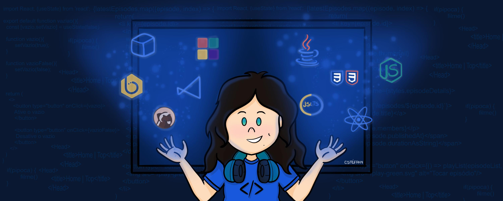

#  Programando por ai
Aprendendo a transformar  a tecnologia.
Gosto de  ver filmes, jogar futsal, pensar na vida e fazer piadas sem graça. 👩🏻‍💻

<h1 align="center">
  
</h1>

# Linguagens Utilizadas

<!--
**Ibsiany/Ibsiany** is a ✨ _special_ ✨ repository because its `README.md` (this file) appears on your GitHub profile.

